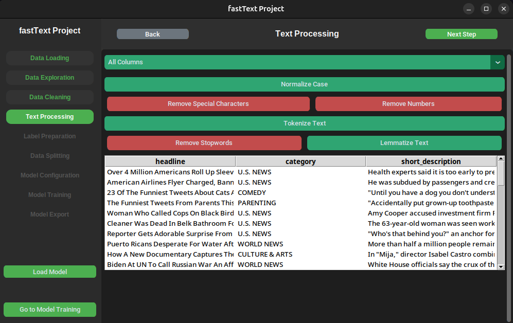

# FastText Application

## 📌 Project Description

This project is an application designed for data processing and training a FastText model. It was developed as part of an academic project at a university and will not be further developed.

The application provides a complete set of tools for data preparation, cleaning, tokenization, lemmatization, and training a FastText model. The process also includes splitting the dataset into training and test sets, as well as exporting the trained model.

---

## ⚡ Features

### 📂 1. Data Loading

- Support for **CSV** and **JSON** files.
- Automatic data type conversion.
- Basic dataset statistics.

### 🔍 2. Data Exploration and Cleaning

- Display of missing value information.
- Filling missing values using:
  - Forward fill,
  - Backward fill,
  - Manual input.
- Removal of duplicates and unnecessary columns.
- Text data cleaning:
  - Case normalization,
  - Removal of excessive spaces,
  - Removal of special characters and numbers.

### 📝 3. Text Processing

- Text tokenization.
- **Stop-word removal**.
- Text lemmatization.

### 🎯 4. Preparing Data for FastText

- Adding the `__label__` prefix to labels.
- Converting tokens into text format.

### 🔀 5. Data Splitting

- Splitting data into **training and test sets** with configurable proportions.
- Preview of the resulting data split.

### 🚀 6. FastText Model Training

- Customizable training parameters:
  - Number of epochs,
  - Learning rate,
  - N-grams,
  - Embedding dimension,
  - Loss function.
- Training the model on user data.
- Display of training process information.
- Exporting the trained model.

### 📊 7. Model Evaluation

- Testing the model on the test dataset.
- Calculating **accuracy** and **classification performance**.

### 🔮 8. Prediction

- Ability to make predictions on new text data.

---

## 🛠️ Requirements

To run the application, install the required dependencies listed in `requirements.txt`:

```bash
pip install -r requirements.txt
```

---

## 🚀 How to Run the Project?

1. **Clone the repository:**

   ```bash
   git clone <repository>
   cd fastTextProject
   ```

2. **Install dependencies:**

   ```bash
   pip install -r requirements.txt
   ```

3. **Run the application:**

   ```bash
   python main.py
   ```

---

## 🖼️ Screenshots

The application includes the following views:

- **Data Loading**  
- **Data Exploration**  
- **Data Cleaning**  
- **Text Processing**  
- **Label Preparation**  
- **Data Splitting**  
- **Model Configuration**  
- **Model Training**  

Screenshots are available in the `docs/` directory.

